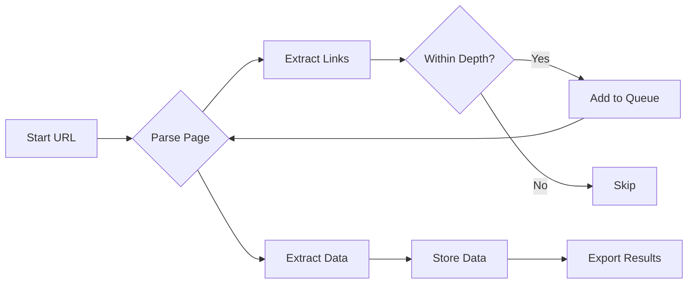

# 🕷️ Vistora Crawler

<div align="center">


[](https://python.org)
[](https://github.com/SairajChowdhary/vistora-crawler-complete)
[](https://github.com/SairajChowdhary/vistora-crawler-complete)

*A powerful and intelligent web crawler built to extract, analyze, and organize web data efficiently* 🚀

[Features](#-features) • [Installation](#-installation) • [Usage](#-usage) • [Demo](#-demo) • [Contributing](#-contributing)

</div>

---

## 🌟 Features

<div align="center">

| Feature | Description |
|---------|-------------|
| ⚡ **Lightning Fast** | Asynchronous crawling for maximum speed |
| 🎯 **Smart Parsing** | Intelligent data extraction algorithms |
| 🔄 **Auto-Retry** | Built-in retry mechanism for failed requests |
| 📊 **Data Export** | Multiple export formats (JSON, CSV, Excel) |
| 🛡️ **Rate Limiting** | Respectful crawling with configurable delays |
| 🔍 **Deep Crawling** | Recursive link following with depth control |

</div>

---

## 🎬 Demo

```
🕷️ Vistora Crawler v1.0
━━━━━━━━━━━━━━━━━━━━━━━━━━━━━━━━━━━━━━━━

🎯 Target URL: https://example.com
📊 Pages Crawled: 1,247
⚡ Speed: 23.5 pages/sec
💾 Data Extracted: 15.2 MB

Status: ████████████████████ 100% Complete ✓
```

---

## 🚀 Quick Start

### Prerequisites

```bash
Python 3.8+
pip package manager
```

### Installation

1️⃣ **Clone the repository**
```bash
git clone https://github.com/SairajChowdhary/vistora-crawler-complete.git
cd vistora-crawler-complete
```

2️⃣ **Install dependencies**
```bash
pip install -r requirements.txt
```

3️⃣ **Configure settings** (optional)
```bash
cp config.example.json config.json
# Edit config.json with your preferences
```

4️⃣ **Run the crawler**
```bash
python main.py --url "https://example.com" --depth 3
```

---

## 💻 Usage

### Basic Crawling

```python
from vistora import Crawler

# Initialize crawler
crawler = Crawler(
    start_url="https://example.com",
    max_depth=3,
    delay=1.0
)

# Start crawling
results = crawler.crawl()

# Export data
crawler.export(results, format="json", output="data.json")
```

### Advanced Configuration

```python
crawler = Crawler(
    start_url="https://example.com",
    max_depth=5,
    delay=1.5,
    user_agent="VistoraCrawler/1.0",
    respect_robots_txt=True,
    max_retries=3,
    timeout=30,
    allowed_domains=["example.com", "example.org"]
)
```

---

## 📁 Project Structure

```
vistora-crawler-complete/
│
├── 📄 main.py              # Entry point
├── 📄 crawler.py           # Core crawler logic
├── 📄 parser.py            # Data parsing utilities
├── 📄 exporter.py          # Data export functions
├── 📄 config.json          # Configuration file
├── 📄 requirements.txt     # Python dependencies
│
├── 📂 data/                # Crawled data storage
├── 📂 logs/                # Log files
├── 📂 utils/               # Helper functions
└── 📂 tests/               # Unit tests
```

---

## ⚙️ Configuration Options

| Parameter | Type | Default | Description |
|-----------|------|---------|-------------|
| `start_url` | string | - | Starting URL for crawling |
| `max_depth` | int | 3 | Maximum crawl depth |
| `delay` | float | 1.0 | Delay between requests (seconds) |
| `timeout` | int | 30 | Request timeout (seconds) |
| `max_retries` | int | 3 | Maximum retry attempts |
| `user_agent` | string | VistoraCrawler/1.0 | Custom user agent |
| `respect_robots_txt` | bool | true | Follow robots.txt rules |

---

## 📊 Performance Metrics

<div align="center">



</div>

---

## 🛠️ Tech Stack

<div align="center">


</div>

---

## 🤝 Contributing

Contributions are welcome! Here's how you can help:

1. 🍴 Fork the repository
2. 🔨 Create a feature branch (`git checkout -b feature/AmazingFeature`)
3. 💾 Commit your changes (`git commit -m 'Add some AmazingFeature'`)
4. 📤 Push to the branch (`git push origin feature/AmazingFeature`)
5. 🎉 Open a Pull Request

---

## 📜 License

This project is licensed under the MIT License - see the [LICENSE](LICENSE) file for details.

---

## 🙏 Acknowledgments

- Special thanks to all contributors
- Inspired by modern web scraping best practices
- Built with ❤️ by [Sairaj Chowdhary](https://github.com/SairajChowdhary)

---

## 📞 Contact & Support

<div align="center">

[](https://github.com/SairajChowdhary)
[](mailto:dantevale333@gmail.com)

**⭐ Star this repo if you find it helpful!**

</div>

---

<div align="center">


**Made with 💻 and ☕ by Sairaj Chowdhary**

</div>
